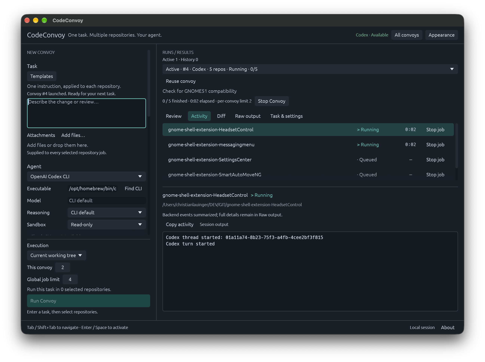

# CodeConvoy

[](https://github.com/ChrisLauinger77/code-convoy/actions/workflows/ci.yml)
[](https://github.com/ChrisLauinger77/code-convoy/releases)
[](https://github.com/ChrisLauinger77/code-convoy/releases)
[](LICENSE)


A local, native desktop task runner for coding-agent CLIs.

**Write one task → choose an agent → select local Git repositories → run with a concurrency limit → inspect each result.**

CodeConvoy is a native Rust/egui implementation with four independent coding-agent backends. There is no web frontend, provider API integration, built-in terminal, or cloud service.



| Backend            | Status    | Authenticated E2E status                                                                             |
| ------------------ | --------- | ---------------------------------------------------------------------------------------------------- |
| Codex CLI          | Supported | User-verified on Linux (two concurrent repositories) and macOS                                       |
| GitHub Copilot CLI | Supported | User-verified on Linux (two concurrent repositories) and macOS                                       |
| OpenCode           | Supported | Unverified; official-source contract and deterministic fixtures tested, CLI unavailable locally      |
| Claude Code        | Supported | Unverified; official documentation/source and deterministic fixtures tested, CLI unavailable locally |

## Downloads and platform support

Published releases provide these native artifacts:

| Platform   | Architecture                 | Artifact                                                   | Status                                                                                |
| ---------- | ---------------------------- | ---------------------------------------------------------- | ------------------------------------------------------------------------------------- |
| Windows 11 | x86_64                       | NSIS installer and portable/Scoop ZIP                      | Installer and portable package published                                              |
| Linux      | x86_64                       | AppImage, Debian `amd64` package, and RPM `x86_64` package | AppImage and Debian package natively tested; RPM installation remains a release check |
| macOS      | Universal (arm64 and x86_64) | Disk image (`.dmg`) containing the universal app           | Natively tested on Apple Silicon; native Intel execution remains a release check      |

ARM Linux/Windows packages are not currently published. The macOS disk image contains both Apple Silicon and Intel executable slices, but each architecture still requires native exact-artifact validation; cross-compilation alone is not treated as runtime proof.

The Windows installer is not code-signed, so Windows may show a SmartScreen warning. The macOS app bundle is ad-hoc signed but has no Developer ID signature or notarization, and Gatekeeper may block its first launch. Verify every downloaded file against the accompanying SHA-256 checksum.

## Installation

### Linux

Download the `.deb`, `.rpm` or `.AppImage` for your system from the
[latest release](https://github.com/ChrisLauinger77/code-convoy/releases/latest).
Run the matching commands in the directory containing your download, keeping
only one version of that package in the directory so the wildcard matches one file.

**Debian / Ubuntu (DEB):**

```sh
sudo apt install ./code-convoy_*_amd64.deb
```

**Fedora / distributions using DNF (RPM):**

```sh
sudo dnf install ./code-convoy-*-1.x86_64.rpm
```

**AppImage:**

```sh
chmod +x ./CodeConvoy-*-x86_64.AppImage
./CodeConvoy-*-x86_64.AppImage
```

If AppImage mounting is unavailable, add `--appimage-extract-and-run` to the
launch command. See [package requirements](#package-requirements-and-first-launch)
for desktop libraries and distribution compatibility.

### Homebrew on macOS

With [Homebrew](https://brew.sh/) installed, add the maintainer's
[tap](https://github.com/ChrisLauinger77/homebrew-cask) and install CodeConvoy:

```sh
brew tap ChrisLauinger77/cask
brew install --cask ChrisLauinger77/cask/code-convoy
```

The [cask](https://github.com/ChrisLauinger77/homebrew-cask/blob/main/Casks/code-convoy.rb)
installs the published Universal macOS app into Applications. It currently clears
the app's extended attributes, including Gatekeeper quarantine, after installation;
the app remains ad-hoc signed and unnotarized.

To update:

```sh
brew update
brew upgrade --cask ChrisLauinger77/cask/code-convoy
```

### Scoop on Windows

With [Scoop](https://scoop.sh/) installed, add the maintainer's
[bucket](https://github.com/ChrisLauinger77/scoop-bucket) and install CodeConvoy
from PowerShell:

```powershell
scoop bucket add ChrisLauinger77 https://github.com/ChrisLauinger77/scoop-bucket
scoop install ChrisLauinger77/code-convoy
```

The [manifest](https://github.com/ChrisLauinger77/scoop-bucket/blob/main/bucket/code-convoy.json)
uses the published Windows x86-64 ZIP and creates a CodeConvoy Start Menu shortcut.

To update:

```powershell
scoop update
scoop update code-convoy
```

Both methods use the existing release downloads. Package definitions can lag a
new GitHub release until their repository updaters finish. Install Git and the
agent CLIs separately; Homebrew and Scoop manage CodeConvoy updates externally.

### Package requirements and first launch

Linux packages are built on Ubuntu 26.04. The DEB is user-verified to install
and run on Debian Forky; AppImage startup is also user-verified there. The minimum
glibc version and compatibility with older distributions need verification after
the runner update.
A working X11 or Wayland desktop and OpenGL/EGL driver are required. The folder
picker needs `libdbus` and an XDG Desktop Portal with a FileChooser-capable
backend appropriate to your desktop; `zenity` is its fallback. Manual path entry remains available.
Git and agent CLIs run from the host. If AppImage mounting is unavailable, run
`./CodeConvoy-0.7.0-x86_64.AppImage --appimage-extract-and-run`.

X11 startup also needs the host's `libxkbcommon-x11.so.0`: install
`libxkbcommon-x11-0` on Debian/Ubuntu or `libxkbcommon-x11` on Fedora/RHEL,
including when using AppImage. DEB/RPM declare this runtime dependency.

The macOS app targets macOS 11 or later and is **ad-hoc signed, not Developer ID
signed or notarized**. Gatekeeper may block the first launch. After verifying the
download and attempting to open it, use **System Settings → Privacy & Security →
Open Anyway** for CodeConvoy if you trust the source. See
[Apple's per-application guidance](https://support.apple.com/en-us/102445).
Do not disable Gatekeeper globally. Windows packages are not Authenticode signed;
Windows may show an unknown-publisher warning.

No package installs Git, coding-agent CLIs, credentials, services, or an updater.
Install and authenticate the agents separately. Desktop launchers may have a
different `PATH` from your terminal, particularly Finder on macOS; provide the
agent's absolute executable path using **Find CLI** or manual entry if automatic
discovery cannot locate it, and ensure Git is on the application's `PATH`.
The portable ZIP uses the same per-user application data
location as the installed Windows app; its executable is portable, its state is
not stored beside it.

**Find CLI**, beside **Executable**, searches for the selected agent in the app's
`PATH` and common installation folders, including Homebrew, `~/.local/bin`, and
OpenCode's `~/.opencode/bin`. Choose a discovered path and click **Use and check**
to save it and run the existing **Check CLI** compatibility check. Searching and
cancelling leave your current setting unchanged; multiple matches require a choice.
Discovery does not run candidates, install software, read shell profiles, change
`PATH`, or start an agent task. A discovered script may still need its interpreter
(such as Node) on the app's `PATH`. On Windows, discovery offers native `.exe`
files, including WinGet links and Scoop shims; shell wrappers are not offered.

On every launch, CodeConvoy checks all four agent CLIs in the background. The
selected agent shows **Checking…**, then **Available**, **Unavailable**, or
**Invalid configuration**. Hover Available for the resolved executable and
supported version information. Missing agents are normal; repository/history
loading and task editing continue while checks run. Configured absolute paths
take precedence; launcher names resolve in the same locations as Find CLI.
Changing or choosing an executable automatically rechecks it. Switching Agent
reuses the session result for the same executable, or starts a check if it is
unchecked or changed. **Check CLI** forces a fresh validation. Availability is
checked again after restart. See the
[CLI lifecycle validation record](docs/cli-availability-validation.md).

See [release procedure and packaging design](docs/releasing.md) and the
[release validation record](docs/release-validation.md) for tested behavior and
remaining platform checks.

## Manual validation (0.7.0)

Each repository can optionally configure one local validation command under
**Repositories → Configure validation…**. Enter an executable (for example `cargo`)
and literal arguments as a JSON array (for example `["test"]`). Commands are
unconfigured by default, persist across restarts, and can be edited or removed.

After an agent job finishes, select its result and choose **Run Validation** in
Review or the **Validation** tab. The command and target directory are shown
before execution. Isolated results always use their original retained worktree;
missing or unverified worktrees report Unavailable, without using another checkout.
Direct results use their original recorded working tree and Git identity.

Validation streams bounded output, shows status, elapsed time, exit code and
execution timestamp, and offers **Cancel Validation**. Its latest command and
execution metadata are saved with that exact repository job. The latest 64 KiB of
output and execution diagnostics remain available only in the current session.
Agent success and Git review remain independent. A saved pass describes that
execution only: subsequent file changes require another validation. Validation can
modify files; Review, Diff and repository-health observations are invalidated afterward.

Validation never starts automatically, commits, stages, pushes, or approves a
result. Commands you configure execute with your local account's permissions.
See [configuration, platform details and validation usage](docs/validation.md).

## Desktop workflow (0.6.0)

Optional system tray support is disabled by default. Enable it under
**Settings → Desktop workflow** for **Show CodeConvoy**, a running-convoy count,
**Show Active Convoys**, and **Quit CodeConvoy**. Show preserves your view; Show
Active opens the existing ACTIVE run-selector group.

Window close defaults to **Quit application**. With a working tray you can select
**Minimize to tray, when supported** immediately. This minimizes the existing
window and keeps jobs running, with Dock/taskbar access retained as a recovery
route. Explicit Quit always uses the existing active-work confirmation and waits
for cancellation/process cleanup; Cancel leaves jobs untouched.

Linux needs a StatusNotifierItem-compatible host. Stock GNOME may have none; no
GNOME extension is required. Unsupported hosts leave CodeConvoy fully usable and
window close uses Quit. Notifications keep their existing filters and restore the
same window when activation is supported. Wayland and OS focus policies may still
require manual desktop activation. See [desktop settings and platform behavior](docs/desktop-workflow.md).

## Visibility and review (0.5.0)

Search **History** by convoy ID, task text, repository name/path or backend. Matching
is case-insensitive; **All**, **Completed**, **Failed**, **Cancelled** and **Needs
Review** filters leave Active convoys and the current selection intact. **Clear
filters** restores the full history list in its original order.

**Review** compares repository outcomes, saved completion changes, review attention
and duration. Filter by **All repositories**, **Changed**, **Failed** or **Needs
Review**, then select a repository to inspect its existing Activity, Diff, Raw
output and Task & settings. Execution success and Git changes are separate.

Registered repositories show their current branch, Clean/Dirty state and availability.
**Refresh state** runs read-only Git checks in the background. Active work displays
Unknown; refresh after completion. These observations never replace historical
completion data.

New results save a small completion observation, not a historical patch. Older
history without that observation shows **Unknown**, even if today's working tree
is available. Direct counts include pre-existing edits relative to the reviewed
HEAD; isolated results retain a changed/unchanged flag against their fixed base.
Template names were not saved in run history and are not searchable. See
[visibility behavior, compatibility and validation](docs/visibility.md).

## Repeated maintenance tasks

Use **Manage groups…** to save named repository selections, and **Templates**
to save/load task text independently of backend settings and repositories.
Selecting a group adds available members; deselecting removes all its current
members, including overlapping or individual selections. Unavailable memberships
stay visible and repairable. Loading a template never starts work.

The repository picker shows **Ungrouped** first, followed by your saved groups.
Click a section header to expand or collapse it; each remembers its state during
the session, including after a group rename. Header checkboxes select or deselect
members without expanding the group, and **Select all / Select none** still cover
every registered repository. Counts show each section's membership and selection;
the overall count counts each repository once. Repositories in multiple groups
share one selection and receive only one job per convoy.

**Add files…** opens a native multi-file picker for Markdown, text, JSON, YAML,
PNG, JPEG and WebP. Files can also be dropped onto the attachment area. Each
job receives the task context through its backend's documented interface.
Preflight and queued jobs check the original files; changes or missing files
fail explicitly. History saves references/metadata. Reuse keeps missing or changed
references visible and blocks launch until you restore and re-add them, or
explicitly remove them. Attachment contents are not saved by CodeConvoy. The selected
CLI/provider still processes supplied context under its own data policy.

Results offer **Activity | Diff | Raw output | Task & settings**. Activity
summarizes actual backend events; Raw output preserves CLI details. Both are
bounded session-only views. See [task context and backend evidence](docs/task-context.md)
for selection semantics, attachment limits, privacy and validation coverage.
[Codex session investigation](docs/codex-sessions.md) explains why ephemeral jobs
have no Resume/Open buttons. See the [Part 2.3 completion report](docs/v0.2-completion.md)
for workflow evidence, native UI checks and remaining platform/provider limits.

For recurring maintenance, register your existing repositories, create a group
such as **GNOME Extensions** or **Package Repositories**, and save a task template.
Load the template, select the group, adjust individual selections, and attach
the current requirements or screenshot. Review the explicit repository list and
Git state before starting. Each repository receives the same task and context,
with an independent result and diff. Groups and templates add no package-specific
automation, commits or pushes.

## Build and run

Requirements:

- Rust 1.95 or later and Cargo.
- Git on `PATH`.
- A working desktop graphics environment.
- The CLI for the agent you want to use, already installed and authenticated using its own login flow. Its executable must be in the desktop application's `PATH` or a common installation folder, or supply its absolute path in the UI. No agent CLI is required for CodeConvoy to start; availability is checked automatically, and **Check CLI** refreshes the selected agent.

On Debian/Ubuntu, the native source-build prerequisites are:

```sh
sudo apt install build-essential pkg-config libx11-dev libxkbcommon-dev libxkbcommon-x11-0 libwayland-dev libgl1-mesa-dev
cargo run --locked
```

For a distributable local binary:

```sh
cargo build --locked --release
```

The executable is `target/release/codeconvoy` (`codeconvoy.exe` on Windows).
Windows source builds need the MSVC C++ build tools and Windows SDK; macOS needs
Xcode Command Line Tools. Packaging additionally needs the tools listed in the
[release procedure](docs/releasing.md); those are not application runtime
requirements. Native macOS UI and Universal DMG checks have passed, and Codex
and Copilot execution is user-verified on macOS. Windows interactive runtime
verification and authenticated OpenCode/Claude execution remain outstanding.

### Windows VMs and graphics

Windows builds use Direct3D 12 through wgpu. Adapter selection can use Windows' WARP software renderer when no compatible hardware GPU is available. This avoids requiring modern OpenGL from a VM's virtual display driver. Linux and macOS continue to use OpenGL.

If a virtual GPU is detected but does not render correctly, explicitly select software rendering in PowerShell before starting a **rebuilt Windows binary**:

```powershell
$env:CODECONVOY_RENDERER = 'software'
.\CodeConvoy.exe
```

This uses the CPU and can be slower. Remove the variable or set it to `auto` to restore normal Direct3D adapter selection. `opengl` selects the previous renderer for driver troubleshooting and requires a suitable OpenGL driver. These Windows-only overrides are not saved in CodeConvoy or agent settings.

The old `egui_glow requires OpenGL 2.0+` startup dialog means the OpenGL renderer could not initialize; the setting above requires the new build. Direct3D 12/WARP still requires a supported, up-to-date Windows installation. Windows CI includes an explicit software-adapter/device/egui-pipeline initialization check; actual VM window presentation needs testing in the guest.

**Browse…** uses the desktop's folder picker: an XDG Desktop Portal on Linux, an NSOpenPanel sheet on macOS, and the native Windows file dialog in folder mode. Linux needs a FileChooser-capable portal backend (such as GTK/GNOME/KDE) and runtime `libdbus`; `zenity` is the fallback when the portal is unavailable. Manual path entry remains available. See [folder-picker implementation and validation](docs/folder-picker-validation.md).

## First run

1. Enter a task and select Codex, GitHub Copilot CLI, OpenCode, or Claude Code.
2. Configure the settings shown for that backend. Codex offers **Read-only** or **Workspace-write** sandboxes. Copilot offers tool approvals and temporary-directory access; these are not Codex sandbox modes. OpenCode offers its own model, agent, variant and permission controls. Claude offers model, effort, turn limit and tool permissions. Model and reasoning support depends on the selected CLI/model.
3. Enter an existing repository **root directory**, or use **Browse…** to fill the path field, then choose **Add repository**. Cancelling the picker preserves the field; choosing a folder never registers it automatically. Select the repository checkboxes for this task.
4. Choose **Current working tree** (the default) or **Isolated worktree**. Set **This convoy** (its job limit) and **Global job limit** (shared by every convoy), then **Run Convoy**. This action becomes available once the selected agent's CLI check settles, so review uses the resolved executable.
5. Review branches and existing changes. Dirty working trees require acknowledgment before **Start convoy**.
6. Select a job to read its live output. Use **Stop** for one job or **Stop Convoy** for the selected convoy. Other convoys continue.
7. Open **Review** for a convoy summary, select a repository, then inspect its Activity, Diff, Raw output, or Task & settings. Use **Refresh review** or **Refresh diff** after external edits. Direct Diff lists untracked names; isolated Diff also renders nonignored new-file contents when representable.

**Isolated worktree** starts each job from the exact committed **HEAD captured at review**. Staged, unstaged and untracked local changes are excluded; the registered working tree is not used as the agent's working directory. A detached Git worktree is created under the application data directory's `worktrees/` folder by default, with no new branch. **Settings → Worktree location** accepts a custom absolute base directory through text entry or a native folder picker. Each new convoy captures this preference and each job gets a unique subdirectory; existing and queued worktrees keep their original locations. Invalid or inaccessible locations fail explicitly without fallback. See [worktree location settings and safety](docs/desktop-workflow.md#worktree-location). Two isolated convoys may run against the same repository concurrently, each in its own checkout. Git creation is serialized per common repository; direct jobs wait for exclusive access. Real nested repositories remain protected.

Isolated jobs show **Preparing** before Running. Stop, Stop Convoy, Stop All and confirmed quit cancel preparation or the running agent. Cancelling the quit dialog leaves work running. Successful, failed and cancelled results are retained, including unchanged and partially prepared worktrees. Completed results do not block exit.

Agent status and isolated result state are separate: a failed or cancelled job can still show **Isolated changes retained**. Git compares both working files and the index with the captured base commit and includes nonignored untracked files. Ignored files alone do not count as changes, but are retained too. **Diff** includes both base comparisons and an effective result patch including nonignored new files. Source HEAD moving later does not change that baseline.

**Activity** labels application lifecycle entries with `[CodeConvoy]`; **Raw output** remains backend output. **Task & settings** shows the immutable mode, short base commit, settings, repositories, context and result observation, with the storage path under **Worktree location**. Reopened history checks each retained result in the background before showing it as available. Missing directories, unavailable repositories and ownership mismatches remain visible with diagnostics. Retained results are working directories, not immutable archives; external edits are reflected by **Refresh diff**. Reuse restores mode and context under the existing validation rules, then takes a fresh baseline and creates new worktrees.

Changed and unchanged isolated results survive restart and are never automatically purged. Unresolved results stay in history, including failed, cancelled and interrupted runs. Probable unreferenced resources are reported and preserved. **Review** lists every launched job with separate agent and result states, file counts, additions/deletions and convoy totals. Statistics are cached Git observations, refreshed in the background after completion/restart or explicitly. Isolated statistics always use the original base; Direct statistics describe the current mutable working tree, including pre-existing edits. Renames count as a deletion and addition; binary files are counted without invented line counts. Distinct staged versions are flagged separately and remain visible in Diff.

**Apply result** is explicit and available only for terminal retained isolated changes, including useful Failed, Cancelled or Interrupted results. CodeConvoy revalidates ownership, registered path/common Git identity, the reviewed result, a clean destination and destination HEAD equal to the original base. It obtains exclusive repository access, performs a Git patch preflight and verifies the result afterward. A changed destination is blocked with a reason. Apply leaves unstaged, uncommitted changes: it never commits, pushes, creates branches/PRs, stashes, resets, merges or resolves conflicts.

The binary-capable patch supports added/modified/deleted files, renames as delete/add, nonignored new files, and executable/symlink changes where Git and the platform can preserve them. Apply conservatively blocks submodules/nested repositories, sparse/unmerged/assume-unchanged entries, divergent staged alternatives, content-conversion attributes, `core.autocrlf` conversion, and patches over 32 MiB. No category is silently omitted. Preflight failure leaves the destination untouched. An error after writing may leave partial destination changes: CodeConvoy reports uncertainty, retains the isolated copy and blocks retry, Discard and cleanup; inspect the destination manually. There is currently no in-app flow to acknowledge and resolve an uncertain Apply.

After Apply, history says **Applied** and the isolated copy keeps its stable Diff. **Clean up retained copy** later removes that copy through verified cleanup, with confirmation. Applied results are resolved, but their ownership metadata remains protected until cleanup completes. **Discard result** requires confirmation (Cancel is initially focused; Escape cancels), removes only the verified CodeConvoy-owned worktree, and preserves execution history as **Discarded**. Its Diff then says the result was discarded. Cleanup failure preserves metadata and permits retry. Direct mode has no Apply, Discard or destructive undo. See [Part 3.2 validation and limitations](docs/review-apply-discard-validation.md).

**Discard convoy…** resolves unresolved retained isolated results in a terminal convoy. **History cleanup → Discard all unresolved results…** does this across terminal history. Both show result counts and require confirmation with Cancel initially focused. Active convoys, Direct changes and already Applied/Discarded results are excluded. Each result uses verified cleanup; partial failures remain protected with diagnostics while successful discards stay discarded. Remove from history remains a separate metadata-only action and becomes available after all retained copies are safely resolved/cleaned. Applied copies still require **Clean up retained copy** in Review; uncertain Apply outcomes remain blocked. See [bulk discard validation](docs/bulk-discard-validation.md).

Open **Settings → Desktop notifications** to choose convoy completion alerts.
Notifications default to enabled for success, failure and review-needed results;
cancellation alerts default to off. Foreground suppression defaults to on,
with failures allowed even while focused. One outcome wins per convoy: failure,
cancellation, review needed, then success. Clicking an alert opens the existing
Review view while CodeConvoy is running, where the desktop supports callbacks.
History restoration never replays alerts. OS permissions and Do Not Disturb still
apply. See [notification settings and platform limits](docs/notifications.md).

**NEW CONVOY is a draft.** Run Convoy captures its prompt, execution mode, selected backend/options, and repositories for review. Start convoy saves an independent run snapshot and queues its jobs. After an accepted launch, the prompt and repository checkboxes clear for your next task. Backend settings, both concurrency limits, and registered repositories stay in place. A failed launch leaves the draft intact. Later edits never alter existing runs. Each backend retains its own draft preferences.

Each convoy has its own concurrency limit. **Global job limit** defaults to **4**, is saved as a user preference, and caps preparation plus agent execution across all convoys. Both limits must allow a start. Changing the global limit affects queued work; lowering it lets existing jobs finish before starting more. Eligible convoys take turns receiving slots, and a repository waiter does not occupy a slot.

In direct mode, CodeConvoy serializes jobs targeting the same canonical repository path, common Git repository, or overlapping parent/child paths. The next job waits, then rechecks Git state. If an earlier convoy changed branch, HEAD, or status since review, the waiting job fails safely and needs a fresh review. These are application-level leases, not locks against external tools or separate instances with different data directories.

Use the bounded, scrollable run selector's **ACTIVE** and **HISTORY** groups to switch convoys without affecting execution. It shows convoy number, agent, state, finished/total progress, duration, and a task summary; selected-run details include elapsed time and its original settings. Any failed job makes the completed convoy **Failed**; otherwise any cancelled job makes it **Cancelled** (or **Interrupted** when recovered after application exit). All jobs must succeed for **Succeeded**. While work remains, state is Running (a job is running), Preparing isolated worktree, or Queued, and the convoy stays in ACTIVE.

**Stop Convoy** cancels only the selected convoy's running and queued jobs. **Stop job** cancels one job. **All convoys → Stop All Convoys** is the distinct emergency stop. Explicit Quit confirms active work and then stops all convoys; optional close-to-tray keeps them running. Restarting after application exit marks unfinished jobs cancelled/interrupted and never resumes agent processes. Partial repository edits remain.

History retains all active convoys, all unresolved isolated results and resolved copies awaiting cleanup, plus the latest 30 other completed convoys, including snapshots, repository paths, initial Git state, timestamps, exit codes, and statuses. Logs remain session-only. Existing version-1 state loads with the default global limit. **History cleanup → Remove convoy #… from history** removes the selected eligible terminal convoy; **History cleanup → Clear removable history** removes eligible terminal convoys, including failed, cancelled, and interrupted direct runs. Convoys with unresolved isolated results are protected, with an explanation in the menu; missing or uncertain results also remain represented. These actions save immediately and only remove CodeConvoy metadata and session output. Repository files, Git changes, registered repositories, and active convoys are untouched.

**Retry** appears for the selected failed, cancelled or interrupted job. It opens normal launch review for a new one-repository convoy with the original task, backend/options, context, execution mode and per-convoy limit. The current draft stays intact. Current registration, Git state, attachments and CLI compatibility are checked again; missing or changed original context blocks Retry. Direct retries use the current working tree and dirty-tree acknowledgment. Isolated retries create a fresh worktree from the committed HEAD captured by the new review. Old files, output and result resolution remain independent; no old result is automatically Applied or Discarded. Retries use the same scheduler, locks and Stop/quit controls. History and Task & settings identify the attempt and source convoy.

In **Review**, use the **Follow-up** checkboxes to select one or more repositories, then **New convoy from selected**. This replaces NEW CONVOY with explicit registered repository selections and copies the original backend/options, execution mode and per-convoy limit. The task and attachments start empty; the global limit and groups/templates stay unchanged. Missing/unregistered repositories are omitted with a message. Load a template or enter a new task, optionally attach context, and explicitly use Run Convoy. Selection does not depend on success, Apply/Discard or the old worktree's availability.

Retry and follow-up provenance are informational links to a previous convoy, with no execution dependencies or automatic chaining. Removing eligible source history does not break later attempts or drafts. CodeConvoy does not automatically commit, push or create PRs. See the [Part 3.3 completion and v0.3 readiness record](docs/retry-followup-validation.md).

**Reuse convoy** copies the selected convoy's prompt, original attachment references, backend settings, per-convoy limit, execution mode, and still-registered repository selection into NEW CONVOY, replacing the current draft. It leaves the global limit unchanged and does not start jobs. Attachment checks run in the background; missing or changed references remain visible and require an explicit resolution before launch. Unregistered repositories are skipped with a message; add them again if needed. Review the draft and use Run Convoy for a fresh Git check.

The execution controls stay visible while the task and repository pane scrolls. **Appearance** follows the system theme by default and saves dark/light overrides across restarts. Older state without a saved choice uses System. Output and diffs render only visible lines, with Copy actions for the full retained text. Diff headers, additions, and removals have distinct styling; wide lines scroll horizontally.

Keyboard navigation uses egui's Tab / Shift+Tab focus traversal, with task, backend settings, repositories, then execution controls in order. Use arrows within menus and Enter / Space to activate controls. Numeric fields become editable when focused. Launch review and About keep focus inside their dialog; Escape closes them. Path entry supports paste. No file chooser is required.

**Select all / Select none** changes repository selection without hiding Git state or skipping launch review. Automatic CLI checks report Checking…, Available, Unavailable (executable not found), or Invalid configuration for each executable independently. **Check CLI** refreshes the selected agent. Detailed diagnostics can be expanded and copied. Availability confirms CLI compatibility, not authentication or model access; job settings are validated during launch review.

**Task & settings** shows friendly option labels, repository paths, the original per-convoy limit, and UTC timestamps. The live global limit is not part of a historical snapshot. **About**, in the footer, shows version, build-time base Git commit when available, project link, and license without a network request. See the [second UX pass validation](docs/ui-ux-validation.md) for native checks and remaining platform limitations.

## Codex contract

The installed CLI interface was checked against **codex-cli 0.160.0**. Detection requires `--no-daemon` so cancellation can target a dedicated process. Older CLIs without this flag are rejected with an explanation. Model and reasoning availability remains the CLI's responsibility.

Invocation is equivalent to:

```sh
codex --no-daemon --ask-for-approval never exec \
  --json --color never --ephemeral --sandbox read-only -
```

The application sends the prompt through stdin and sets the working directory to the selected repository. Optional model and reasoning overrides are separate arguments. It never constructs a shell command string, manages API keys, or reads CLI credential files. Sandbox bypass is not exposed. Existing CLI configuration, repository instructions, hooks, tools, authentication, and network behavior remain under Codex's control. `--ephemeral` disables Codex session history for these invocations; resume is deferred.

See the official [Codex noninteractive documentation](https://learn.chatgpt.com/docs/non-interactive-mode). The user has successfully verified authenticated execution on Linux against two real repositories concurrently, including independent changes, output capture, and Git diff inspection. Successful macOS execution is also user-verified. This behavior and the Codex invocation are preserved when adding Copilot.

## Copilot contract

Copilot has been user-verified end-to-end on Linux and macOS. Linux testing used two real repositories running concurrently. Its installed help/version output and generated CLI flags have also been checked locally.

This installation has two versions: the normal launcher reports **1.0.91**, while `copilot --no-auto-update --version` reports the bundled **1.0.65**. CodeConvoy passes `--no-auto-update` to both detection and execution, so they consistently use the bundled executable and do not initiate CLI updates. **Check CLI** reports that effective version. If your bundled CLI is too old, it reports the missing capability; updating Copilot is a separate user action.

The default command shape is:

```sh
copilot --no-auto-update --no-ask-user --no-color --plain-diff \
  --output-format text --stream on --no-remote --no-remote-export \
  --allow-tool=write --deny-tool=shell
```

CodeConvoy sets the selected repository as the process working directory and writes task/context to **stdin**, then closes it. Without attachments, prompt bytes remain exact; images add native file arguments as described in [task context](docs/task-context.md). Copilot documents piped input as noninteractive prompt mode. There is no shell pipeline in the implementation, no `exec` subcommand, and no `-p -` argument: that would be a literal prompt in Copilot. Each job starts a fresh local invocation; there is no resume, remote connection, fleet mode or session sharing. CodeConvoy supplies the selected direct or isolated working directory.

Available controls:

| Control                            | CLI behavior                                                                                                              |
| ---------------------------------- | ------------------------------------------------------------------------------------------------------------------------- |
| Executable                         | `copilot` on PATH or an absolute executable path                                                                          |
| Model                              | Blank uses the CLI default; otherwise `--model VALUE` (including `auto`)                                                  |
| Reasoning effort                   | Blank uses the CLI default; otherwise `--reasoning-effort none/low/medium/high/xhigh/max`, as supported by bundled 1.0.65 |
| File edits; shell denied (default) | `--allow-tool=write --deny-tool=shell`                                                                                    |
| Existing CLI approvals             | No tool-approval override; unapproved actions may fail in unattended mode                                                 |
| Allow all tools, including shell   | `--allow-all-tools`; this is an explicit permission to run shell tools automatically                                      |
| Temporary directory                | CLI default access, or `--disallow-temp-dir`                                                                              |

Copilot path checks and its existing configured permissions apply. CodeConvoy never enables `--allow-all-paths`, `--allow-all-urls`, or `--yolo`. It removes an inherited `COPILOT_ALLOW_ALL` blanket grant from the child environment so it does not bypass the UI choice. Authentication variables, `COPILOT_HOME`, and the user's configuration/authentication files are not changed by CodeConvoy. Existing MCP servers, instructions, hooks, and other CLI settings remain the CLI's responsibility. Tool approvals are **not an OS sandbox**; file-edit mode can edit files, and all-tools mode can run shell commands with the user's permissions.

Copilot streams plain stdout and labelled stderr directly to the job log, including partial lines. CodeConvoy does not normalize or pretty-print Copilot events. Exit zero means the CLI succeeded; any nonzero or signal exit is a failure, and a CodeConvoy-requested stop is cancelled. This does not prove the agent fulfilled the task: review its response and diff, particularly when permissions denied an action. Codex continues to use its existing JSONL completion criteria. Copilot may keep its own session history/logs; no ephemeral flag was exposed by the inspected CLI. CodeConvoy itself still persists only task/run metadata and preferences.

References: [GitHub's programmatic execution guide](https://docs.github.com/en/copilot/how-tos/copilot-cli/automate-copilot-cli/run-cli-programmatically) and the installed `copilot --no-auto-update --help` / `copilot --no-auto-update help permissions`. The captured help used by tests is in `tests/fixtures/copilot-1.0.65-help.txt`.

### Safe manual Copilot E2E test

Use two disposable repositories, each containing a **tracked**, clean `CODECONVOY_COPILOT_SMOKE.md` with a placeholder heading and a small README. Select Copilot, **File edits; shell denied**, concurrency **2**, and this task:

> Edit only CODECONVOY_COPILOT_SMOKE.md. Replace its placeholder with a heading “CodeConvoy Copilot smoke test”, the current repository's directory name, and a short summary of its README. Do not create or modify any other files, run shell commands, or perform Git operations. Report which file you edited.

Verify both jobs succeed, each output identifies its own repository, and each current Git diff contains only the expected tracked file. Using tracked files makes the result visible in CodeConvoy's staged/unstaged diff viewer; untracked files would only appear in its status list. This test is for the user to run manually.

### Manual multi-convoy E2E check

Use four disposable, clean repositories with tracked smoke-test files. Set global limit **2**. Launch Codex with **Workspace-write** in the first pair with per-convoy limit **1**, asking it to edit only the smoke-test file. Immediately change the draft to Copilot with **File edits; shell denied**, select the other pair, and launch with limit **1** and a different smoke-test instruction. Switch between runs: confirm their original agent/settings, independent logs/diffs, progress, and at most two running jobs. Stop one convoy while it is active and verify the other continues. Inspect retained partial edits.

For repository queuing, launch a second convoy against a repository still in use by the first. It must wait. If the first changes its Git status, expect the waiting job's safety recheck to fail before an agent starts; review the new state and launch a fresh convoy. No reset, stash, branch change, commit, or push is part of this check.

## OpenCode contract

The backend uses the official [OpenCode CLI](https://opencode.ai/docs/cli/#run), checked against the released [v1.18.34 source](https://github.com/anomalyco/opencode/blob/v1.18.34/packages/opencode/src/cli/cmd/run.ts). No OpenCode installation was available on the development Mac, and no authenticated task was run. [Validation details and limitations](docs/opencode-validation.md) distinguish fixtures, native UI checks, and outstanding Linux/E2E checks.

Default invocation:

```text
opencode run --format json --dir <absolute-repository-path>
```

CodeConvoy spawns the executable directly with separate arguments, sets its working directory to the selected repository, writes the exact prompt to stdin and closes the pipe. No shell interpolation, positional prompt, `-` prompt sentinel, shared server, or session resume is used. Each job owns a fresh local process. Inherited `PWD` and `GIT_*` overrides are removed so repository discovery stays with that job.

| Control     | Behavior                                                                                                                                                                              |
| ----------- | ------------------------------------------------------------------------------------------------------------------------------------------------------------------------------------- |
| Executable  | `opencode` on PATH or an absolute path                                                                                                                                                |
| Model       | **OpenCode default** when blank; otherwise `--model=provider/model`. Use `opencode models` separately to discover configured models. No fixed catalog or provider entitlement checks. |
| Agent       | OpenCode default when blank; otherwise `--agent=NAME`. Choose a primary agent from `opencode agent list`.                                                                             |
| Variant     | OpenCode default when blank; otherwise `--variant=NAME`. Provider/model-specific setting, including reasoning effort; not a shared Codex/Copilot scale.                               |
| Permissions | **Existing rules; reject asks** by default. **Auto-approve; keep denies** adds `--auto`.                                                                                              |

OpenCode owns login, credentials, providers, model availability and configuration. CodeConvoy does not ask for or store keys, inspect credential files, edit OpenCode configuration, or create accounts. Existing configuration/environment, repository instructions, plugins, MCP tools and session retention remain under OpenCode's control. This includes automatic sharing if the user has configured it; CodeConvoy does not add `--share` or disable the user's configuration.

[OpenCode permissions](https://opencode.ai/docs/permissions/) are tool rules, **not an OS sandbox**. Existing rules may already permit shell commands and file writes. In unattended run mode, requests that require approval are rejected; auto mode approves such requests while explicit denies remain enforced. There is no interactive approval UI. `--thinking` only affects displayed thinking blocks, so it is not offered as a reasoning control. Agent-specific rules still apply. OpenCode may warn and fall back to its default agent when a requested agent is unknown or is a subagent; review the output.

Automatic checks and `Check CLI` inspect `run --help` for the required capabilities and report `--version` where available. No version-number ordering is imposed. Older versions missing a required flag are rejected with an actionable message. Authentication is exercised only by an actual job.

OpenCode's output handler reads its own JSON event stream. Assistant text is readable; tool records, step metadata, errors and unknown events stay visible as JSON, and stderr is labelled. A job succeeds only with exit zero, a final `step_finish` whose reason is `stop`, no session error events, and no malformed/oversized JSON records. Tool errors can be recovered by the agent and remain visible; success does not prove the requested change was made. Token-limit stops, missing completion and nonzero/signal exits fail conservatively. Stop uses the existing process-tree cancellation and retains partial edits. Activity summarizes actual events, while Raw output retains the CLI records. Both remain session-only.

OpenCode settings participate in draft persistence, launch snapshots, history and **Reuse convoy**. Old Codex/Copilot version-1 state still loads. Concurrency, round-robin scheduling, canonical repository locks, dirty-tree review and baseline revalidation are unchanged.

### Safe manual OpenCode E2E test

1. Independently install/authenticate OpenCode and check `opencode --version`, `opencode run --help`, `opencode models` and `opencode agent list`. Use an existing configured primary agent with file-edit permission; inspect its permissions yourself.
2. Prepare two **disposable**, clean Git repositories. Each should contain a tracked README and a tracked `CODECONVOY_OPENCODE_SMOKE.md` with a placeholder heading. Do not use important working repositories.
3. Select **OpenCode**, keep model/variant at **OpenCode default**, choose the verified primary agent, keep **Existing rules; reject asks**, and set both concurrency limits to **2**. Run **Check CLI**, select both repositories, then review/start this task:

   > Edit only CODECONVOY_OPENCODE_SMOKE.md. Replace its placeholder with a heading “CodeConvoy OpenCode smoke test”, this repository's directory name, and a short summary of its README. Do not modify any other files, run shell commands, or perform Git operations. Report the file you edited. If permissions prevent editing, report that and stop.

4. Verify both jobs succeed, each response identifies its own repository, and each Diff contains only its tracked smoke-test file. Check for denied tools or fallback-agent warnings even on success.
5. Use **Reuse convoy**: confirm settings and both repository selections are restored without execution. For cancellation, start a separate read-only inspection task in these disposable repositories and stop it while active; inspect retained edits and remaining processes. A real completed authenticated task is required before updating OpenCode's E2E status.

Optional help-only compatibility probe (never invokes a model):

```sh
cargo test --all-features --test opencode installed_opencode_accepts_generated_arguments -- --ignored --nocapture
```

## Claude Code contract

Claude is the fourth independent backend. It uses the documented [print interface](https://code.claude.com/docs/en/headless) and [CLI flags](https://code.claude.com/docs/en/cli-reference). No Claude installation or authenticated execution was available on the development Mac. See [validation evidence and limitations](docs/claude-validation.md).

Default invocation:

```text
claude --print --input-format text --output-format stream-json --verbose \
  --no-session-persistence --permission-mode dontAsk
```

CodeConvoy passes separate arguments directly, sets the selected repository as the working directory, writes task/context to stdin and closes it. Tasks with images use structured stream-json input; tasks without attachments retain exact prompt bytes. It removes inherited `GIT_*`/`PWD` overrides and inherits Claude authentication, provider environment and configuration. Each job is a fresh invocation; CodeConvoy does not log in, request keys, change Claude settings, attach to a server or resume a session.

| Control     | Behavior                                                                                                                            |
| ----------- | ----------------------------------------------------------------------------------------------------------------------------------- |
| Executable  | `claude` on PATH or an absolute executable path; native `claude.exe` on Windows                                                     |
| Model       | **Claude default** when blank; otherwise `--model=ALIAS_OR_ID`, without a fixed model catalog                                       |
| Effort      | Claude default, or `--effort=low/medium/high/xhigh/max`; CLI/model support applies                                                  |
| Permissions | **Existing approvals; deny asks** (`dontAsk`, default), or **Accept edits / file commands** (`acceptEdits`)                         |
| Max turns   | Blank preserves Claude's default; otherwise `--max-turns=POSITIVE_INTEGER`. Reaching it fails completion. This is not a time limit. |

These are [Claude tool permissions](https://code.claude.com/docs/en/permissions), **not an OS sandbox**. Existing approvals can allow writes and shell commands. `acceptEdits` additionally auto-approves edits and common filesystem commands such as `mkdir`, `touch`, `mv` and `cp`. Unresolved permission requests are denied because CodeConvoy supplies no interactive permission host. Existing permission hooks still apply. No additional directories or blanket bypass are enabled by CodeConvoy; configured access remains Claude's responsibility.

Use trusted repositories: print mode skips workspace trust prompts and can load repository hooks/MCP configuration. Disabling session persistence does not disable all Claude logging, configuration or network activity.

`Check CLI` checks the core help interface and displays the version where available, without contacting a model. Some documented flags are hidden from help, so this is a compatibility check, not proof that every optional setting works on an older CLI. Missing Claude is a normal state and does not affect other backends.

Output retains Claude's JSON records for assistant/tool activity and metadata, extracts final response text, and labels stderr. Success requires exit zero and one valid final `result` with `subtype=success`, `is_error=false`, required result fields, and no explicit execution/protocol error or reported interruption. Errors, missing results, malformed/oversized records and activity after the result fail conservatively. Recovered tool failures and permission denials remain visible; review the response and diff even after success. Assembly allows 1 MiB per record, following the official SDK's default; existing display/log caps still apply.

Scheduling, repository safeguards, cancellation, draft clearing, persisted options, snapshots, history and **Reuse convoy** use the shared lifecycle unchanged. No state migration is required, and reuse never starts work automatically.

### Safe manual Claude E2E test

1. Use an already installed/authenticated Claude Code. Check its version/help independently and inspect existing permissions, hooks and MCP settings. Do not use important repositories.
2. Prepare two **trusted, disposable**, clean Git repositories, each with a tracked README and a tracked `CODECONVOY_CLAUDE_SMOKE.md` placeholder.
3. Select **Claude Code**, leave model/effort at **Claude default**, set **Max turns** to **10** and both concurrency limits to **2**. Keep **Existing approvals; deny asks** if your existing rules allow editing the smoke file. Otherwise explicitly select **Accept edits / file commands**, understanding its broader filesystem-command approval. Run **Check CLI**, select both repositories, review and start:

   > Edit only CODECONVOY_CLAUDE_SMOKE.md. Replace its placeholder with a heading “CodeConvoy Claude smoke test”, this repository's directory name, and a short summary of its README. Do not modify other files, run shell commands, or perform Git operations. Report the file you edited. If permissions prevent editing, report that and stop.

4. Confirm independent output and expected tracked-file diffs in both repositories. Inspect permission denials even on success. Prompt instructions are not an access boundary. Turn-limit failures are not successful E2E results.
5. Select **Reuse convoy** and verify all settings/selections return without execution. Separately start an inspection task, stop it while active, and check process cleanup and retained edits. Record the real CLI version, platform, options and outcomes before claiming authenticated E2E success.

An optional installed-CLI probe runs help/version only:

```sh
cargo test --all-features --test claude installed_claude_accepts_generated_arguments -- --ignored --nocapture
```

## Repository safety and data

CodeConvoy inspects registered working trees and, when requested, creates owned detached worktrees. Registration/removal never clones, deletes, resets, stashes, checks out, commits, or pushes. External diff/textconv and filesystem-monitor commands are disabled for inspection. Duplicate and nested repository selections are rejected. Each direct job rechecks branch, HEAD, common repository identity and porcelain status immediately before starting; detected state changes fail that job without affecting other jobs.

Codex Workspace-write, Copilot file-write/tool approvals, and OpenCode/Claude permissions can permit the **agent** to modify files. CodeConvoy is an orchestrator, not an extra security sandbox. Stop terminates processes and retains partial edits; it cannot roll changes back. Review the diff before committing. Git checks are not filesystem locks: another application can still edit a repository, and changes within an already-dirty file may leave the same porcelain status.

State is saved atomically in the conventional per-user application data directory, available from the footer’s Local session tooltip:

- Linux: `$XDG_DATA_HOME/codeconvoy`, normally `~/.local/share/codeconvoy`.
- macOS: `~/Library/Application Support/CodeConvoy`.
- Windows: `%LOCALAPPDATA%\CodeConvoy\data`.

A lock prevents two instances sharing the same state directory. On Unix the directory is owner-only and state files are created with mode `0600`. Invalid or newer-format state fails startup with an actionable error and is preserved. Unfinished saved jobs are marked cancelled/interrupted at next startup; they are never silently resumed.

**Prompts, templates, groups and attachment metadata are saved, so do not paste credentials into tasks.** Attachment contents are not saved. Agent and validation stdout/stderr, execution diagnostics, and diffs are never persisted by CodeConvoy. Validation saves its latest command and execution metadata with its repository job; do not place secrets in validation arguments. Agent output is bounded to the latest 512 KiB per job/view (32 MiB shared total, oldest job logs evicted first); validation output retains the latest 64 KiB per job. Both remain available only for the application session. The UI reports truncated/dropped output. Diffs are live views: direct mode includes pre-existing edits; isolated mode uses the retained checkout and its fixed base commit. They are not saved patch snapshots. The agent CLIs may maintain their own operational logs according to their configuration.

## Development

The [CI workflow](.github/workflows/ci.yml) runs on pushes to `main` and pull
requests targeting `main`. Changes consisting entirely of `**/*.md` files skip
CI; changes that also include other files still run it. CI uses stable Rust and
Python 3.14 on `ubuntu-latest`, `macos-latest`, and `windows-latest`, runs the
packaging tests and checks below, and additionally checks software graphics
initialization on Windows. No authenticated agent tasks are run.

```sh
python3 -m unittest discover -s packaging -p 'test_*.py'
cargo fmt --check
cargo clippy --locked --all-targets --all-features -- -D warnings
cargo test --locked --all-features
cargo build --locked --release --bin codeconvoy
```

Renovate maintains dependencies and CI/release tooling. See
[CI and Renovate policy](docs/releasing.md#ci-and-renovate) for the inherited
preset, approval rules, and release compatibility checks.

The `test-support` feature builds a deterministic local test executable. It is never used as an application backend and requires no account or network. Integration tests use temporary Git repositories and handshake-controlled fixture processes to check simultaneous Codex/Copilot/OpenCode/Claude convoys, both concurrency limits, draft snapshots, repository leases and release, cancellation/failure isolation, shutdown, process descendants, output capture, and Git rechecks. Pure scheduler tests check round-robin fairness without timing dependencies. Core tests cover all four backends' command arguments, output handling, exit interpretation, backend preferences and old-state compatibility, persistence, history recovery, and Git inspection. Copilot integration tests use its real backend with a local fixture executable, not a provider. An optional installed-CLI check runs only help/version commands:

```sh
cargo test --all-features --test copilot installed_copilot_accepts_the_exact_command_flags -- --ignored --nocapture
```

Read [the architecture](docs/architecture.md) for module boundaries and implementation tradeoffs. Claude is the fourth and final backend for the v0.1.0 cycle. The v0.2 task-context changes add only backend-owned attachment validation/transport and optional Activity summaries; no additional backend is added. Authenticated Claude/OpenCode E2E and Windows runtime verification remain outstanding.

## License

MIT. See [LICENSE](LICENSE).
